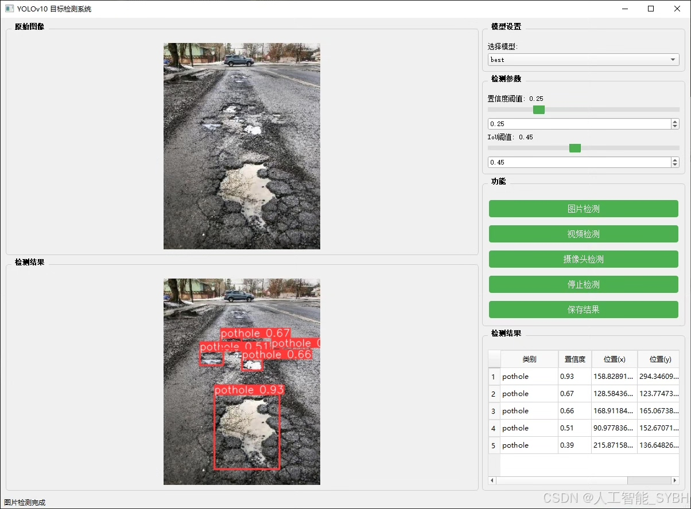
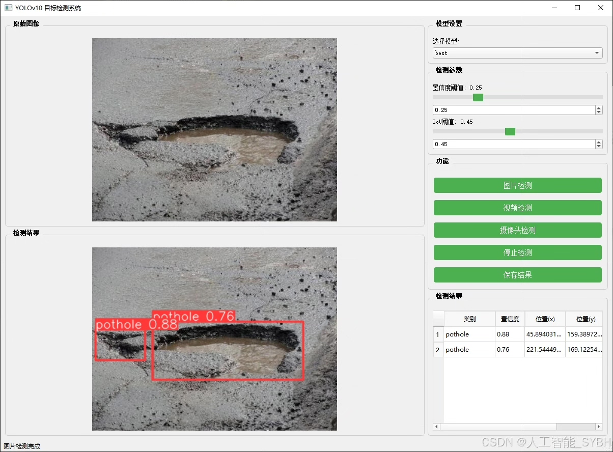
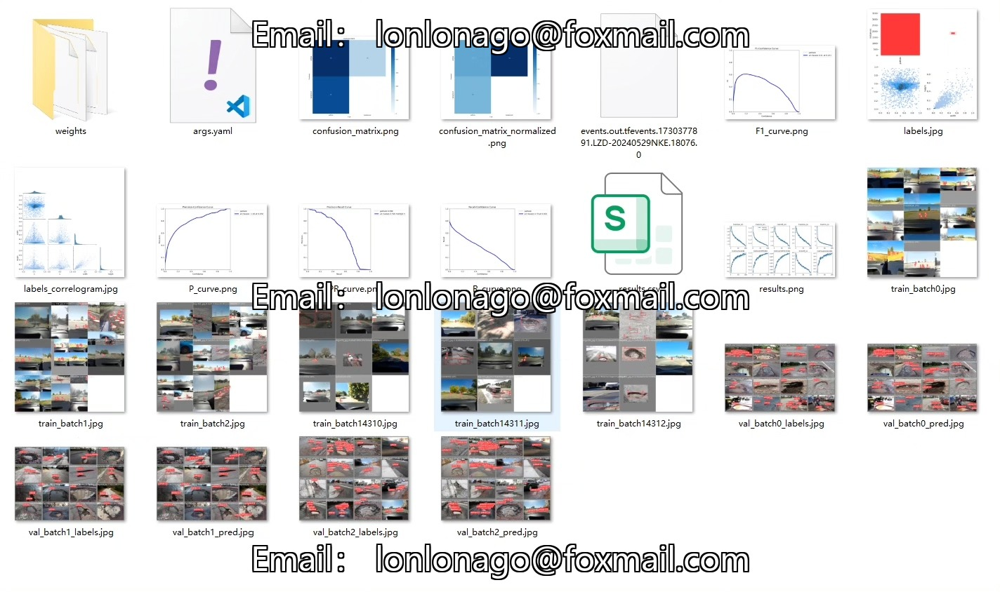
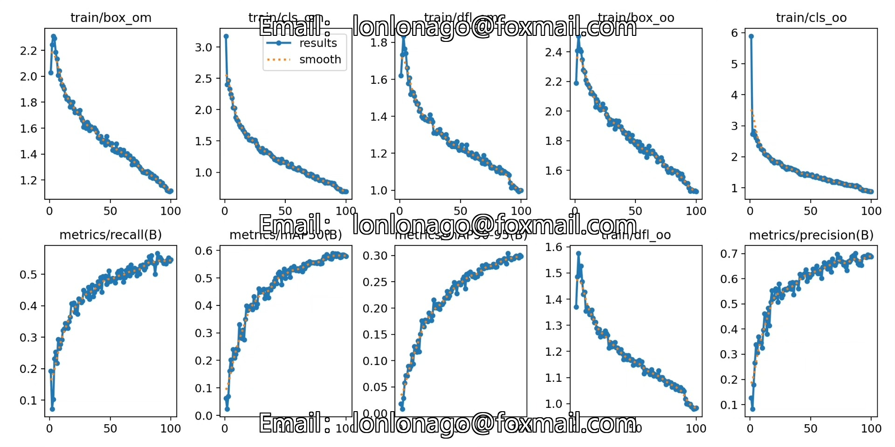
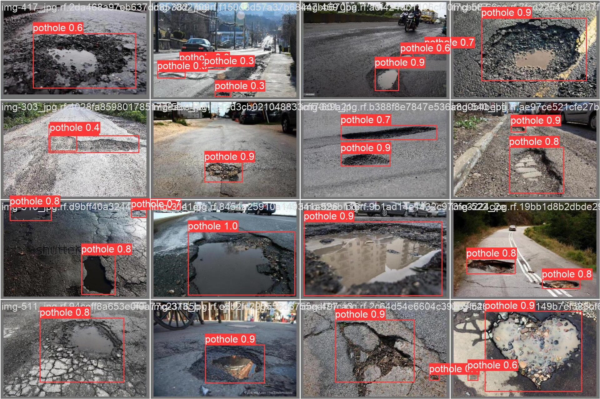
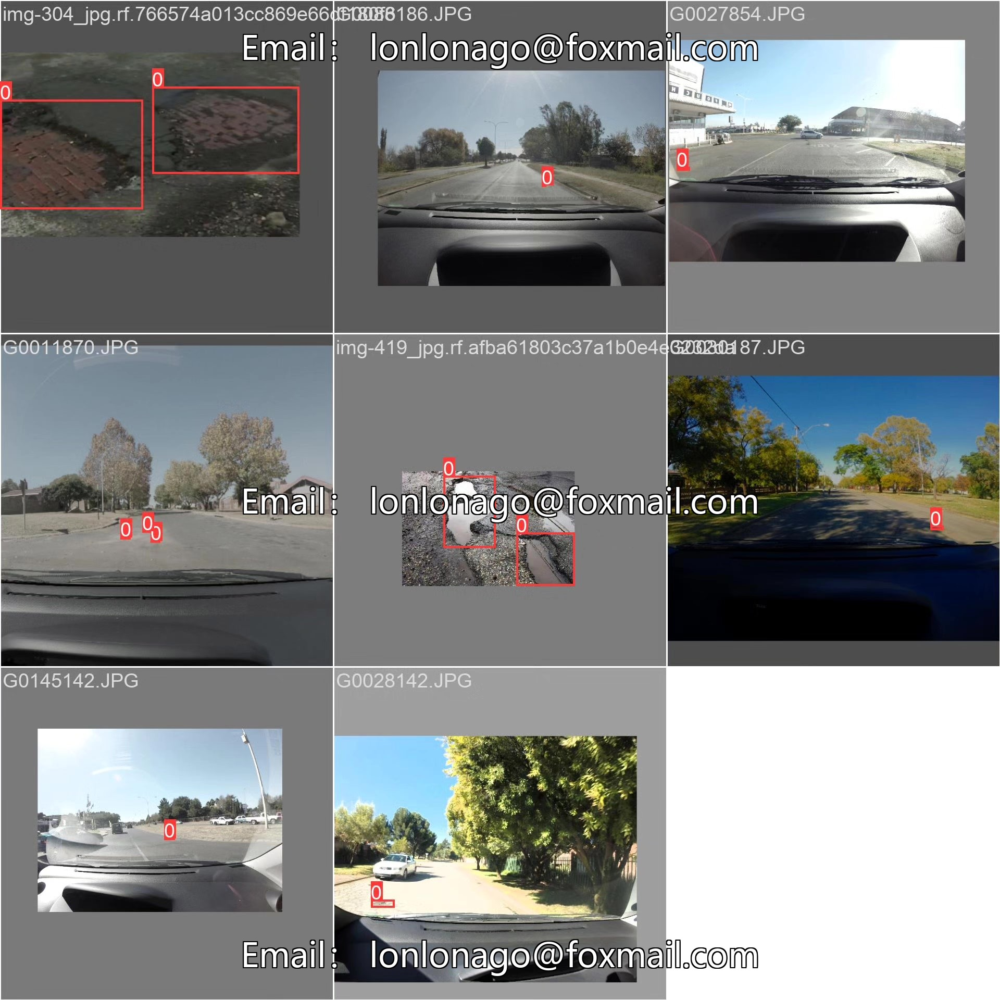
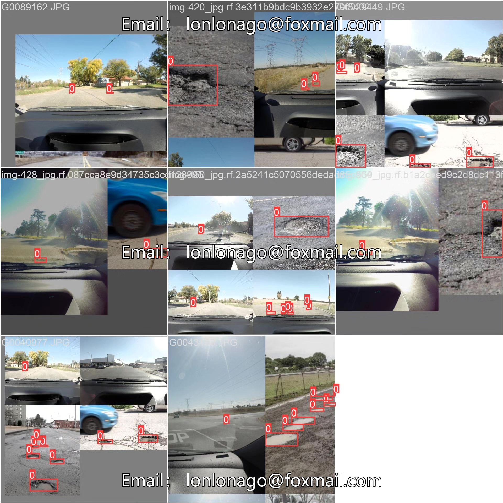

# Based on deep learning YOLOv10 road pothole and damage detection system (YOLOv

## Body

This project utilizes the YOLOv10 (You Only Look Once version 10) object detection algorithm to develop an efficient road pothole detection system. This system can automatically detect pothole areas in road images or videos, providing data support for road maintenance and repair.

The company's products have obtained the official commercial license certification of YOLO.

We provide after-sales service.

After payment, we will provide WeChat IDs for instant questions and answers.

Environment configuration: We will provide a tutorial on environment configuration, and WeChat will provide答疑.

Remote installation services: If you need remote configuration, additional fees apply at $69. If the configuration fails, all fees will be refunded (specially for older computers, only the installation fee will be refunded).

Retraining dataset: After setting up the environment, you can train on your own computer. If you need us to retrain, just pay $69 plus computing power fees (2.5 yuan/hour).

Full after-sales service

## Images

## Payment

Here is a pay link on Stripe ( https://buy.stripe.com/3cs8yP7sY87d0vu9AB ). Please contact me lonlonago@foxmail.com after funding $89, and I will send you a complete data files , thank you!

